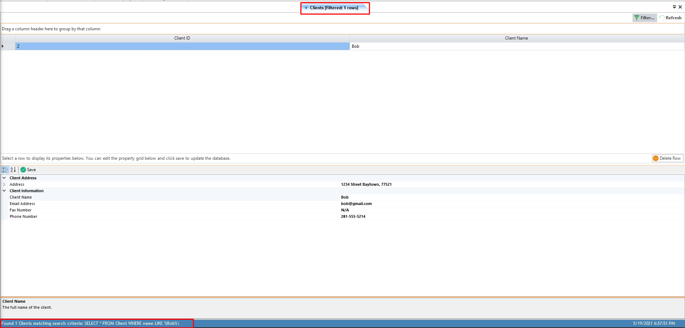
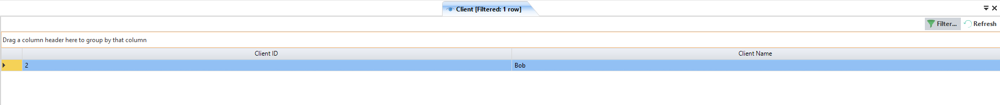
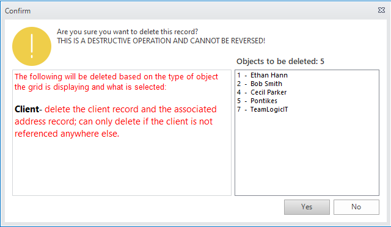

====================
Working With Objects
====================

Objects provide the basis for many of the functions of Survey Manager. There are four types of objects you can create and manipulate:

* Clients
* Realtors
* Title Companies
* Billing Rates

.. attention:: All of the steps and UI for creation and editing of these objects is the same. The only differences are in the type of data each object requires and what the object is used for.
   In the following examples, we will walk through how to create, find, and edit a Client object but remember that these steps apply to virtually any object in Survey Manager.

.. _creating-a-client:

Creating a new Client
---------------------
The following example assumes you have a working database connection ready to accept data.

1. Click on the ``New`` button in the **Client** group under the **Objects** ribbon tab.
2. The **New Client** page will appear in the workspace.
   
    .. image:: images/new_client_page.png
      :width: 800
      :alt: New client page in workspace

3. This page contains what is known as a *property grid* and allows you to edit the properties of the Client. This type of grid is used throughout the application to edit various things.

.. important:: A **Client** object is considered valid when it has an address, name, email address, and phone number. The fax number is optional.

4. Expand the **Client Address** -> **Address** group and enter the required fields.
5. Enter the client's name, email address, phone number, and (if needed) a fax number.
6. If you are satisfied with the data entered, click the ``Save`` button identified by a green check-mark.
   
   1. If a job is currently opened, you will get a dialog asking if you want to go ahead and associate this client with the open job.
      In this case, we will select ``No``.

   2. You will also get a dialog asking if you want to create another client.
      In this case, we will select ``No``.

7. If you selected **No** when asked if you would like to create another client, the client page will close.
   Either way, the status bar at the bottom of the application window will update to indicate the status of the client creation.

We now have a client object in the database with the name **Bob**.

Finding an Existing Client
--------------------------
The following example assumes you have created a client object named *Bob* and it is present in the database.

1. Click on the ``Find`` button in the **Client** group under the **Objects** ribbon tab.
2. An :doc:`advanced search dialog <advancedSearch>` will show:

    .. image:: images/advanced_dialog_clients.png
      :width: 300
      :alt: Find clients advanced dialog

3. Let's assume we know the client's name, Bob. In this case, select **Like** from the second combo box. Leave the first combo box on **Name** because we are searching by the client's name.

.. note:: If you know the client's exact name (case-sensitive), you can instead select **Equals** from the combo box.
   There are many other ways to match the search text to data in the database. See :doc:`the advanced search dialog <advancedSearch>` for more information.

4. Type the text to search for in the text box. In this case, type **Bob**.
   
5. Because we are only searching by one parameter, we can go ahead and click the ``Search`` button.
   
6. If results were found, the dialog will close and a new page will open in the workspace displaying the filtered results. This page is similar to the **View All** page except it has been
   filtered down to only include the results matching the search criteria. The status bar at the bottom displays the number of clients found and also the SQL query used to search the database.
   The title of the page also changes to indicate that we are in a filtered view.

Editing Clients
---------------
Editing objects is done from the View grid that is displayed either after searching for an object or viewing all objects.

The following example assumes you have found an existing client object named *Bob* and you have the View grid open.

1. Click any cell in the View Grid, or alteratively select the entire row, for the client named *Bob*.
2. The property grid below the View grid will update with the selected object's information. In this case, we see the properties for the client object named *Bob*.
3. To make edits to the object, simply change the corresponding data in the property grid much like when you created the object.
4. Once done with your edits, click the ``Save`` button with the green check mark to save and update the selected object in the database.
5. You can verify the object was saved by checking the status text in the bottom left of the application's window or by clicking the ``Refresh`` button and viewing the edited objects
   data. The ``Refresh`` button loads the data straight from the database so whatever is viewed in the grids after clicking Refresh is what's in the database.

You can also delete objects from the View Grid. To do this, an entire row must be selected by clicking the farthest-left point of the row. All of the cells in that row will be highlighted indicating the row is selected:

Once a row or multiple rows are selected, simply click the ``Delete Selected Rows`` button at the bottom right of the View grid. You will get a pop-up warning you about the pending deletion:

Ensure that the selected objects in the list view on the right of the dialog match what you intended and then confirm the deletion. The dialog will explain what will be deleted in addition to the selected object.

.. note:: If you receive and error after confirming the deletion, it is because the selected object is already being referenced by another object and therefore it cannot be deleted.
   Either delete the object that references the one you are trying to delete or change the reference to be another object. As of now, the application makes no attempt to direct you to
   the object doing the referencing.