===============
Getting Started
===============
This section will show you how to quickly get started with creating and editing survey jobs. It will also show you how to setup the initial environment needed for using the application.

Setup
^^^^^

Licensing
----------

The first launch of the application may look something like this:

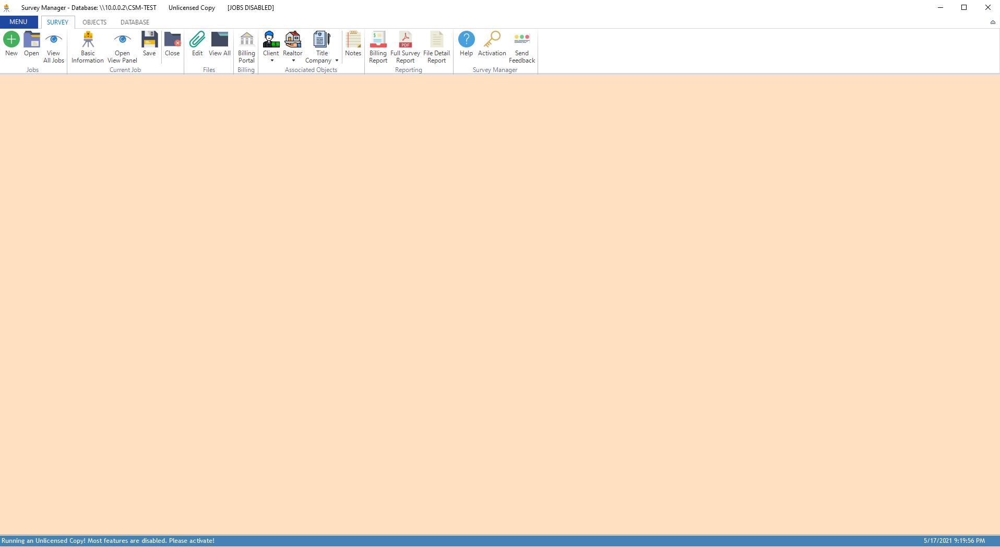

If the product is unlicensed, click the ``Activation`` button on the main ribbon and enter your product key. If the product key was valid, the application will be licensed and
all features will be enabled. If you don't have a product key, you can email thomasthunderous@protonmail.com to request one.

After successfully licensing the application, the title bar will change to denote the product's current status:

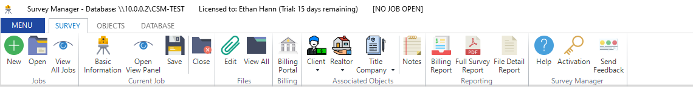

At any time, you can click the ``Activation`` button to change/update your product key, view information about your license, and purchase a new product key.

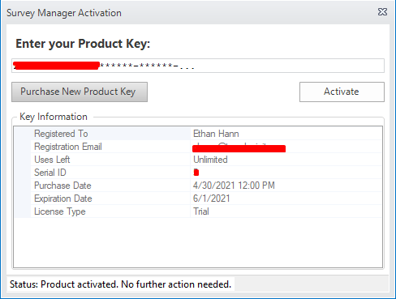

.. important:: Once a product key has been entered, you can not "un-license" the application. Even if you enter an invalid product key afterwards, Survey Manager will continue to use the
   last valid product key that was entered. In this way, you are protected from accidentally un-licensing the application.

Connecting to a Database
------------------------

Before data can be entered and manipulated, you must connect to a valid Database on a server. To connect, navigate to the Database tab on the ribbon and click the ``Connection Settings`` button:

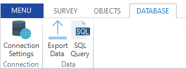

This will open a dialog where you can enter the connection details. Simply fill out the required fields to connect to a database.

* Server: *the IP or hostname of the database server*
* Port: *the port number the server listens on for database connections*
* Database: *the name of the database to connect to*
* Username: *a database user who has permissions to select, insert, update, and delete from the database*
* Password: *the password of the database user*

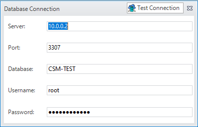

.. important:: Only one of these connection dialogs can be opened at a time. If you try to open another one, a pop-up will show giving you an error.

Once all required fields are entered, click the ``Test Connection`` button in the title bar of the dialog to begin connecting to the database. If no error occurred, a new button will appear, ``Finished`` that will close the dialog and save the connection.

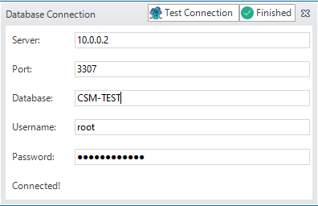

Basic Survey Workflow
^^^^^^^^^^^^^^^^^^^^^

Creating the Survey Job
-----------------------

1. Click the ``New`` button under the *Jobs* group and enter a job number. This job number is plain text and can be anything you wish. The default prefix is the last two digits of the current year followed by a dash symbol.
   This can be changed in the application's settings.
   
   .. important:: Two different jobs cannot have the same job number.

2. After the job has been created, the title bar (at the top) and the status bar (at the bottom) of the window will change to correspond to the current state of the application:

   .. image:: images/after_new_job_title.png
     :width: 800
     :alt: After creation of a new job

   .. image:: images/after_new_job_status.png
     :width: 800
     :alt: After creation of a new job

Editing the Job's Information
-----------------------------

Once a job has been created, the next step is to edit it's basic information and add objects to it. Click the ``Basic Information`` button under the *Current Job* group. This will open the
page that allows you to edit some basic information about the currently opened survey job. Simply fill out all of the fields that are required (marked with a red \*). The currently selected
field is highlighted yellow to make navigation easier.

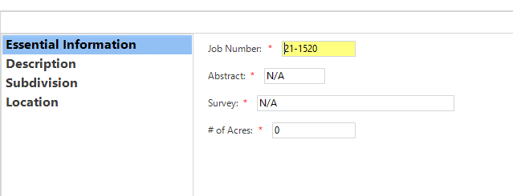

While most of the fields here are self-explanatory, the last sub-page (Location) has some extra functionality. If a Client object has been set (and the survey's location is the same as the Client's address), you
can click the ``Set to Client's Address`` button to automatically set the location for the job.

However, if no Client has been set, you will get a pop-up letting you know you must set a Client before you can use that feature. As of now, all addresses and locations are assumed to be in the state of Texas and only
four Counties are supported: *Chambers*, *Liberty*, *Harris*, and *Galveston*.

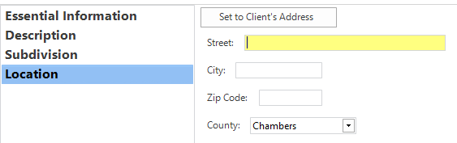

Once all information is entered, simply click the ``Save and Update`` button on the top right of the Basic Information page. This will save the changes locally and update the open job.
Then, you can close the Basic Information page.

.. warning:: If you close the page before clicking the ``Save and Update`` button, none of the changes will be saved to the open job. All of the changes will have to be re-entered and saved correctly.

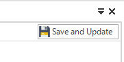

At any time, you can open a view panel that will show an overview of the currently opened job. This panel opens to the right side and only one panel can be opened at a time. To open it, click
the ``Open View Panel`` button under the Current Job group on the Survey Ribbon tab. This view does not update in real time, however it can be refreshed by clicking the ``Refresh`` button on the panel. Certain fields
in the View Panel are also editable and provide a quick shortcut to edit some attributes of the job. *This panel will update if you open another job with it showing*.

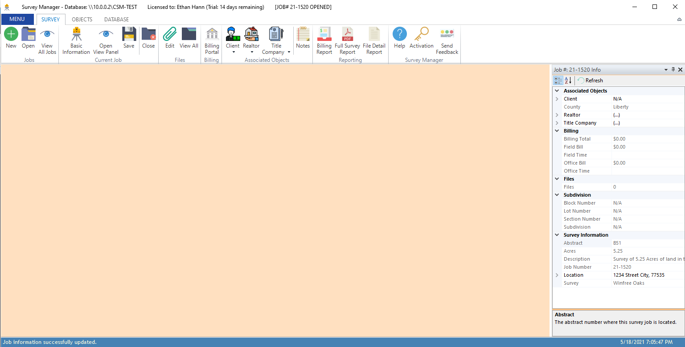

.. tip:: Editing a property in the View panel, for instance the name of the **Client** for the job, will also change the underlying object in the database when you save the job.
   So, if you change the Name property for the **Client**, save the job, and then view all Clients, you will see the changed name in the properties for that client. What this means is that
   the properties for the objects associated with the job are actually mapped to database tables.

Adding a Client Object
----------------------

Now that we have a job with basic information, the next step is to add a client object. This can be accomplished a few different ways. See the reference page for :ref:`creating a new client <creating-a-client>` for more information about client objects and objects in general.
For now, we will add the client using the **Client** command on the **Survey** ribbon. To do this, click the drop-down arrow underneath the ``Client`` button in the Associated Objects group and then click the ``New...`` button.

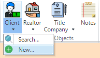

This will open a new page which allows you to edit the Client's details. It is on this page where you can enter the client's address, name, email address, fax number, and phone number. To
enter the address, expand the *Address* group and enter the required fields.

.. tip:: You can press the <TAB> key on your keyboard to navigate to the next field. This works most places where you enter data.

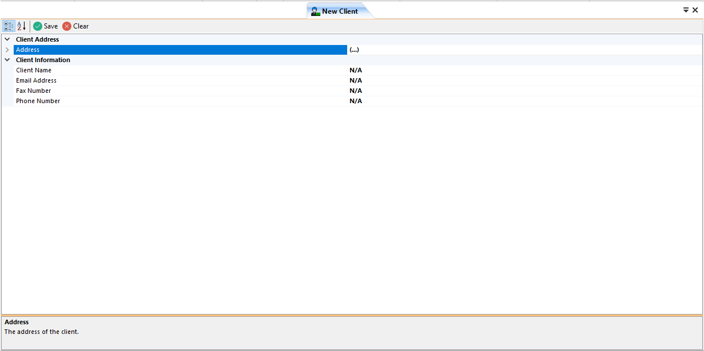

After entering all of the required data, simply click the ``Save`` button on the page. The client will be inserted into the database and you will be asked if you wish to associate the new client
with the currently opened job. In this case, click ``Yes``.

.. note:: If you choose no, you can still add the client to the job by searching for it. You don't have to recreate the object again.

You will also be asked if you wish to create another client. If you want to create multiple clients in a row, you can click ``Yes``; otherwise, click ``No`` to close the page.

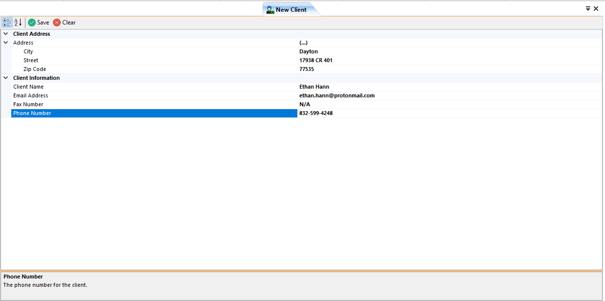

.. important:: This workflow is the same for the other associated objects. The pages are laid out similar to the New Client page only requiring different data depending on the object being created. 
   See :doc:`Working With Objects <allAboutClients>` for more information about objects and how to manipulate them.

After you have created the client and associated it with the job, if you have the View Panel open, you can click ``Refresh`` to see the new client there.

We now have the absolute minimum amount of information needed to save the job to the database!

Saving the Job Persistently
---------------------------

All of the changes so far (with the exception of the Client) have not touched the database. The survey job is still in your local computer's memory. In order to make the survey persistent and allow others to open it,
you must click the ``Save`` button under the Current Job group on the Survey ribbon. This will insert the survey (if it's a new job) or update (if it's an opened one) in the database. After doing this,
the status bar will update to let you know the status of the saving. **It is worth noting that by default, there is an auto-save feature turned on that will save the opened job every 15 minutes. This is configurable in the Settings.**

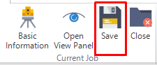

This concludes the quick-start guide. There are many more functions available to you to manipulate surveys. You can add files, billing information, time entries, notes, a realtor, and a title company to the survey job.
You can also run reports on the data in the database. These reports show an overview of the survey job in an easy to print PDF format. Continue through this documentation to learn more about all of these features!