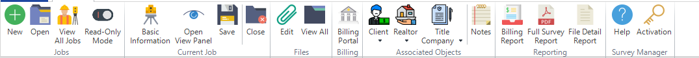
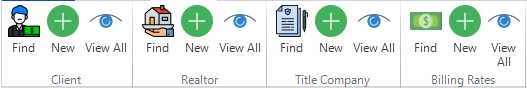
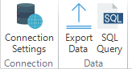
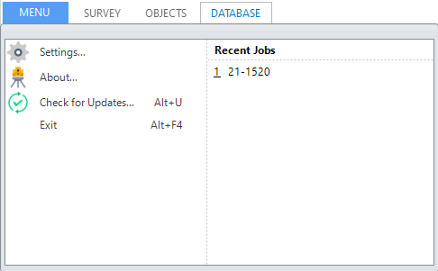

==============================
Introducing the User Interface
==============================

Survey Manager features an advanced dock panel user interface, very similar to Visual Studio, allowing you to adjust the navigation and viewing workspace in many ways. Docked panels and floating
windows can be arranged by dragging or by using the commands after right-clicking the title bar of the panels and floating windows. Docked panels can be minimized with the Auto Hide feature. Most
dock panels can also be tabbed to the tab bar by just dragging them to the center of the guide diamond.

Most commands on the ribbon open a page in the main workspace. Some may also open dialog boxes that can not be docked and must be acknowledged before anything else can be clicked.

The Ribbon
^^^^^^^^^^

The ribbon is similar to Office-style applications and functions in much the same way. It can be collapsed by double-clicking a tab's name or by using the small arrow to the far right of the ribbon.
The commands on the ribbon are laid out as logically as possible. The main tab, **Survey**, contains commands useful for creating and manipulating existing survey jobs as well as some application specific
commands such as a link to this Help and the Activation dialog. See **INSERT LINK TO SURVEY TAB REFERENCE HERE**

The next tab, **Objects**, contains commands for creating, editing, and viewing the different objects that can be created to associate with a survey job. See **INSERT LINK TO OBJECTS TAB REFERENCE HERE**

The last tab, **Database**, contains commands for defining the database connection and interacting at a lower level with the database. See **INSERT LINK TO DATABASE TAB REFERENCE HERE**

The ribbon also has a **Menu** drop-down which contains commands to edit the settings, see the about dialog, and check for updates as well as exit the application. This drop-down also
houses the most recently opened survey jobs so opening a currently worked on job is quick and easy. See **INSERT LINK TO MENU DROP-DOWN REFERENCE HERE**

The Workspace
^^^^^^^^^^^^^

The workspace in the center of the application's window allows for dragging and dropping of pages and panels. Pages can be docked to either the top, bottom, left, or right of the window as well as
become thier own "floating" window which also allows docking. Let's look at a simple example:

Suppose we have the **View Panel** open (which shows us information about the currently opened job). By default, this panel will dock itself to the right of the screen:

.. image:: /images/view_panel_after_open.png
  :width: 800
  :alt: View panel after open

The three buttons in the top right of the panel allow you to manipulate the behavior of the panel: the arrow drop down provides options for floating, docking, auto-hiding, making the panel a tabbed document, and closing the panel.
You can also click the pin icon next to the arrow to quickly enable or disable the auto-hide feature:

.. image:: /images/dock_options.png
  :width: 200
  :alt: Dock options for panels

Now, suppose we were to open a few more pages. Let's open the **Billing Portal**, **Notes**, and **New Title Company** pages. By default, all of these pages will open in the main tab bar underneath the ribbon:

.. image:: /images/workspace_after_opening_pages.png
  :width: 800
  :alt: The workspace after opening a few pages.

We can re-organize these pages so that we have the **Notes** and **New Title Company** docked to the bottom (in their own tab group), and the **Billing Portal** docked to the center. We will also make the **View Panel** a floating window.
To move pages, simply drag their title to a new location, following the diamond guide, or use the right click menus on the title of the page.

.. image:: /images/diamond_guide.png
  :width: 800
  :alt: Diamond guide

.. image:: /images/after_workspace_rearrange.png
  :width: 800
  :alt: After the workspace has been re-arranged.

Floating windows can be moved around (even to another monitor), resized, and can also contain other windows in what is essentially a floating tab-group.

**The UI is highly customizable and it is up to you how you would like to re-arrange things so that the application can fit your workflow!**

